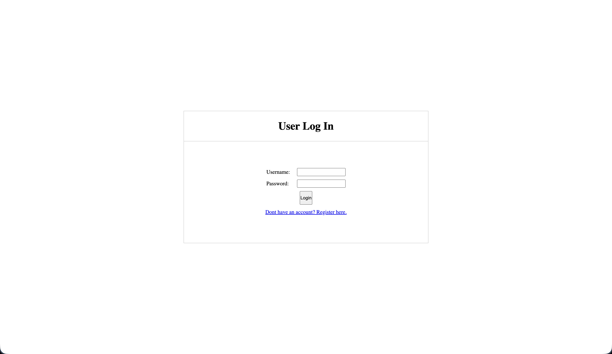
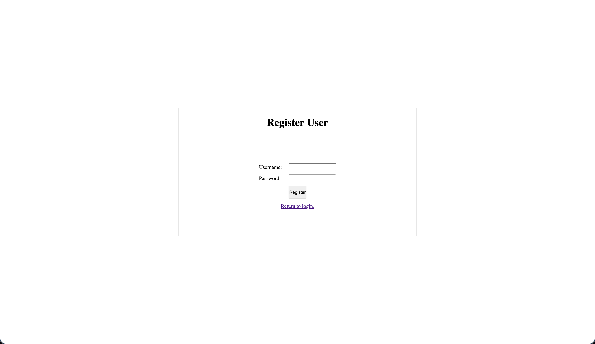
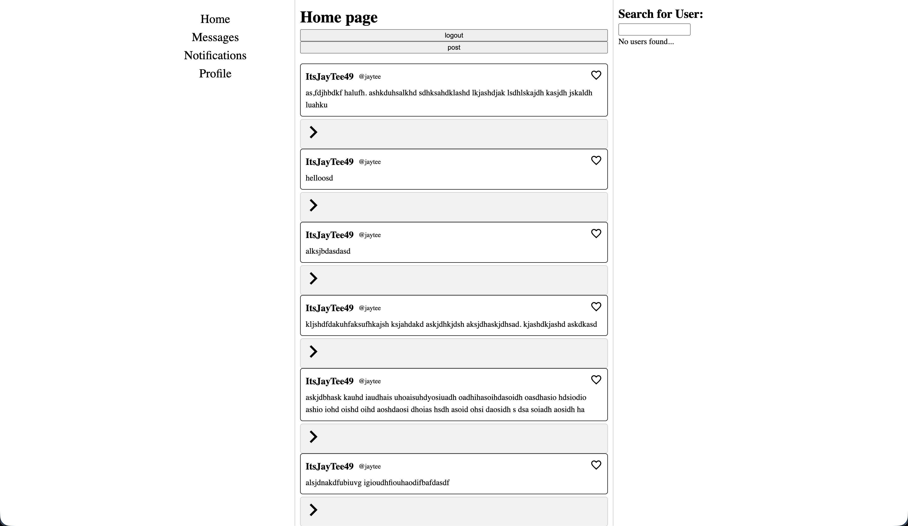
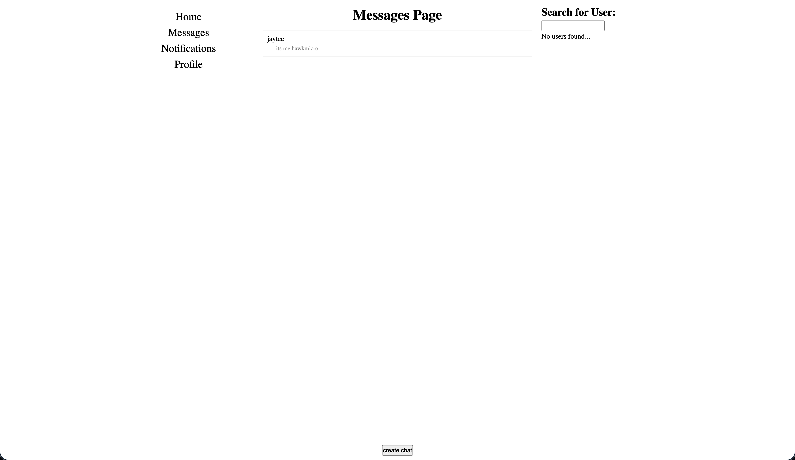
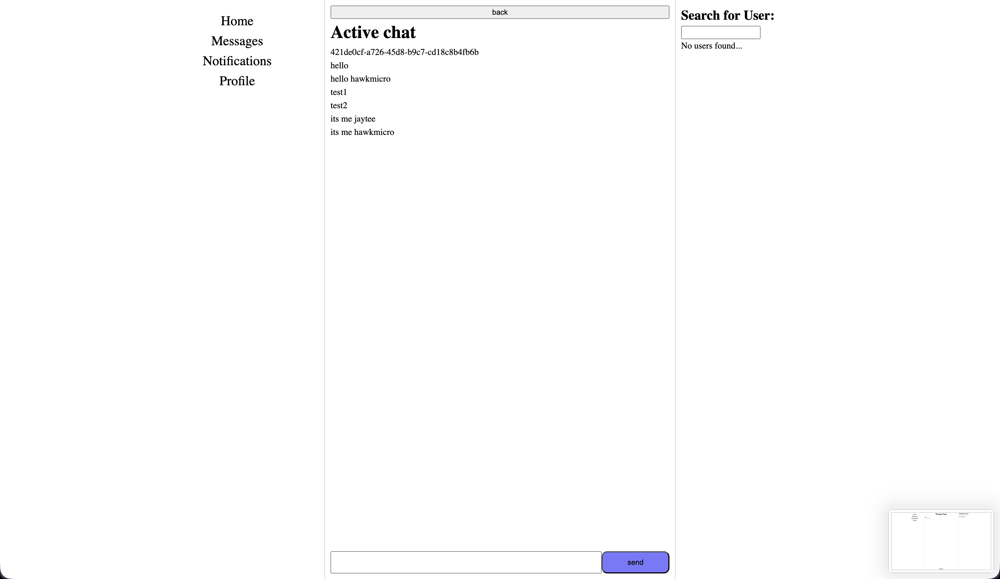
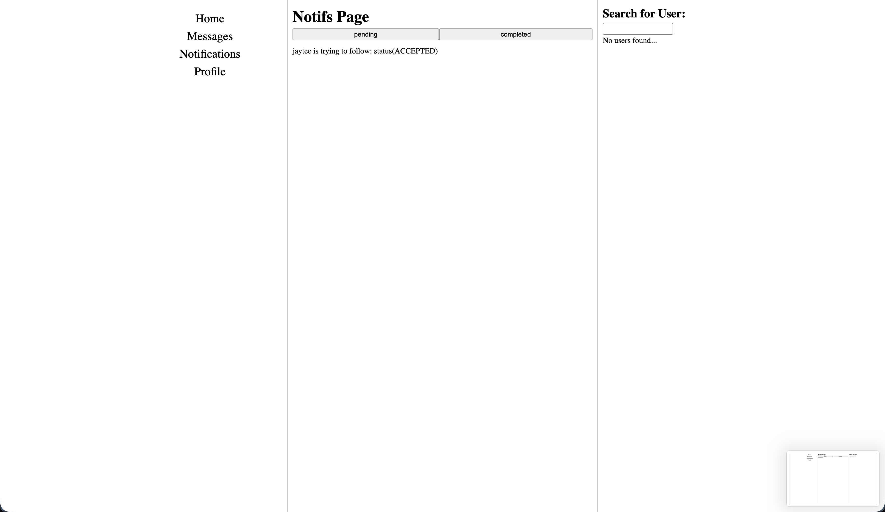
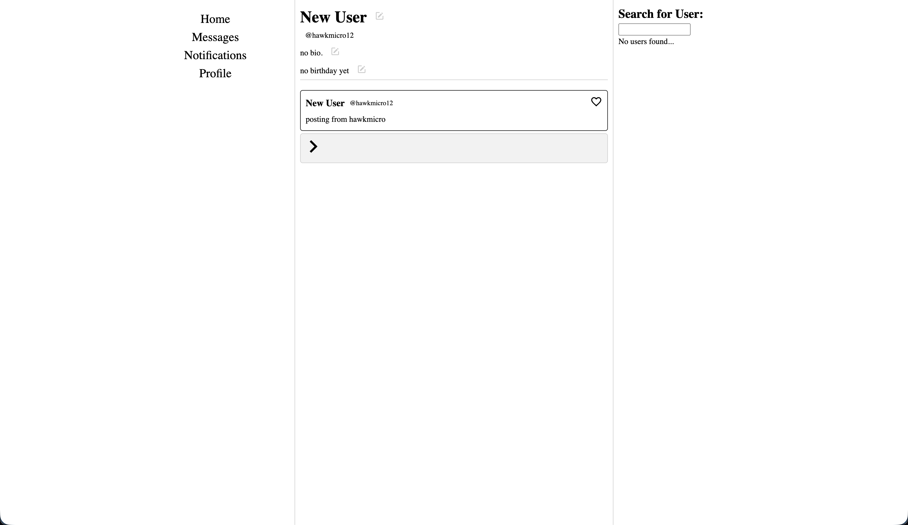

# twitter-clone

This was one of the final projects in The Odin Project online cource to learn full stack development. The task was to clone an existing website to see how they work, and I chose to clone Twitter.

## Login / Register

## Home Page

## Messages / Chat

## Notifications Page

## Profile Page

